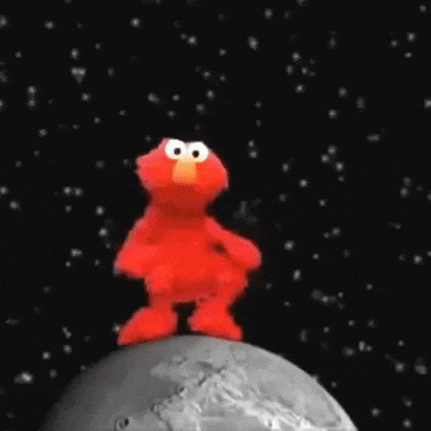

# `Into to CI/CD` - Lab Graduates

The GitHub users below ***ACED it*** on their [CI/CD lab](intro.md)! 😎

[//]: # (Add your username below, in alphabetical order to prevent conflicts and duplication.)

- @aaronsteers
- @alex-b-griffin
- @alexbcook
- [@atopp-slalom](https://github.com/atopp-slalom)
- @bbainsslalom
- @biancaorozco
- @brandiskanes
- @cmgonzalezjr
- @datapun
- @domedwards
- @egelnoteagle
- @etishtalreja140
- @joemcfarren
- @jpbradle
- @kevincifone
- [@kgalvin-slalom](https://github.com/kgalvin-slalom)
- @kgalvin
- @malikmubeen1
- @matthewrohleder
- @mikemusi
- @muhamedsukkar-slalom
- @nathaniellarson
- @oso-caro
- [@Peter-Griffin-Slalom](https://github.com/Peter-Griffin-Slalom)
- @sanketninawe
- @sarkarsam

## Commence the celebration

[//]: # (Psst - feel free to add more art or GIFs here if you are so inclined!)

  

 

