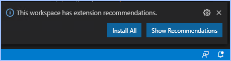

# [Docs](../README.md) > [Labs](./index.md) > **Intro to DevOps Lab**

_Learn GitHub and CI/CD by directly updating this website._

`A Slalom DataOps Lab`

**Table of Contents:**

- [Setup](#setup)
  - [Install Prereqs](#install-prereqs)
  - [Login to GitHub.com](#login-to-githubcom)
  - [Fork your own personal copy of the repo](#fork-your-own-personal-copy-of-the-repo)
  - [Clone your forked repo in GitHub Desktop](#clone-your-forked-repo-in-github-desktop)
  - [Open repo in VS Code](#open-repo-in-vs-code)
- [Develop](#develop)
  - [Create a new branch](#create-a-new-branch)
  - [Make some changes!](#make-some-changes)
  - [Commit your changes](#commit-your-changes)
- [Submit](#submit)
  - [Create a PR (Pull Request)](#create-a-pr-pull-request)
  - [Wait for your PR to be approved and merged](#wait-for-your-pr-to-be-approved-and-merged)

## Setup

### Install Prereqs

**Overview**

To complete this lab, you will at least need the following components installed on your local machine:

- VS Code
- Git
- GitHub Desktop

_TIP: If you have not yet installed these, please visit the [DevOps QuickStart page](../setup/index.html) for automated installation instructions._

**How-To**

1. To install these on your local workstation, follow the instructions located at the following links:

- Mac OSX: [docs.dataops.tk/brew](https://docs.dataops.tk/brew)
- Windows: [docs.dataops.tk/choco](https://docs.dataops.tk/choco)

### Login to GitHub.com

**Login via Web**

1. If you don't yet have a GitHub account, create your free personal GitHub account [here](https://github.com/join).
   - _**Tip**: Rather than create multiple accounts, we recommend using a single GitHub account for both work and personal development projects._
2. Once you have an account created, login or reset your password with the links provided [here](https://github.com/login).

**Login via GitHub Desktop**

3. Open the GitHub Desktop application and repeat the login process within the app.

### Fork your own personal copy of the repo

**Understanding Forks and Pull Requests:**

- **Forks** - A "fork" of a repo is a full and complete copy of the upstream code, which we can then safely update without affecting the original. The original upstream repo, called the "upstream" for short, will not be affected by any of our changes in the fork. We do not require any special permissions on a repo in order to fork it.
- **Pull Requests** - Once we are done with our changes we can optionally send a Pull Request to the upstream repo, requesting the owners to "pull" our changes into their repo.

**Creating a personal fork:**

1. In a new browser tab, navigate to the GitHub repository: [https://github.com/slalom-ggp/dataops-docs](https://github.com/slalom-ggp/dataops-docs).
2. At the top-right of the page, click "Fork".
   - _If asked where to create the new fork, select your GitHub to create your own personal copy._
   - **NOTE:** This fork is your own personal copy of the full code repository used in this site. Since the code is open source, you can do anything you want with it.

### Clone your forked repo in GitHub Desktop

1. Navigate to your new personal fork (`https://github.com/<your-username>/dataops-docs`).
2. After browsing to your personal fork, click on the green `Code` button and select `Open with GitHub Desktop`.
   - _**Do not** select `Download Zip`, as this will not register your repo properly with git._
3. Follow the wizard to clone the repo to your local machine.
   - When prompted for a location for the new folder,  click "Choose..." and then create a new root-level folder called `Source` (for example, `c:\Source` on Windows).
   - After selecting the new `Source` folder, GitHub will suggest a subfolder called `c:\Source\dataops-docs`.
   - Click `Clone` to complete the process and download all of the files to your local workstation.

### Open repo in VS Code

1. Open your newly cloned `dataops-docs` folder in VS Code. You should see an `Open in VS Code` option in **GitHub Desktop**, but if not, you can also open **VS Code** directly and select `Open Folder`.
2. The first time you open the repo, VS Code should prompt you to install recommended plugins (aka "extensions"). Review the recommendations and then install each one. These add recommended functionality to VS Code for this project, each developer has similar user interface and similar development experience.

   

3. To test the markdown preview feature, open any file ending in `.md` and look on the right hand side for the preview window. If you don't see a preview, click the magnifying glass at the top right of the file pane.
   - _If you still are not able to preview the Markdown, try going back to step 4 (recommended plugins) or just search VS Code extensions for "Markdown" and install the top result._

## Develop

### Create a new branch

1. Within VS Code, press `ctl+shift+p` (Windows) or `cmd+shift+p` (Mac) to open the command palette. This gives you a long list of available commands, with recommended and recently-used commands at top of the list.
2. In the command prompt, type `create branch` and then select the option entitled `Git: create branch...`.
3. Give your branch a name. For example, how about `janesmith-cool-new-updates`?

### Make some changes!

_You are now ready to make your own changes to the code of this website. Go ahead and make changes to any files you want. Remember to save them and use the preview feature to see if the result looks like you expected. When you are done, go ahead to the next step._

> **Tip:** The vast majority of software documentation runs on a text formatting language called "markdown" - which is a lightweight, easy-to-read way to add formatting to plain text. If you aren't familiar with Markdown, or if it's been a while, there's a helpful Markdown CheatSheet [here](https://res.cloudinary.com/practicaldev/image/fetch/s--2rTn_7XO--/c_limit%2Cf_auto%2Cfl_progressive%2Cq_auto%2Cw_880/https://dev-to-uploads.s3.amazonaws.com/i/5zhubbpov3m3ly9a1t9c.png).

**What will you change?**

Will you engage your creativity, share your favorite app, or fix something that bugged you? The choice is yours! To complete this lab, make any change at all that makes this site better. No change is too small: add a single line, fix a single typo, or update an out of place character - these are all fantastic additions.

_Here are some ideas of changes you can submit:_

_**Option 1. Add your favorite software packages (Recommended!)**_

Everyone has a favorite app! What could you add to the package lists on the [Mac](../setup/mac.md) or [Windows](../setup/windows.md) QuickStart pages to make them even more awesome for the next round of students?

_**Option 2. Add your own username to the list of lab graduates**_

Optionally, either in addition to or in place of other updates, why not add your GitHub username to the [cicd-graduates](cicd-graduates.md) page?! A small piece of immortality in exchange for only a few minutes' effort...

_**Option 3. Make this lab better!**_

Everything on docs.dataops.tk is auto-published from this repo. How about submitting...

1. Typo corrections or other fixes.
2. Simpler rewrites of more complicated instructions.
3. Missing explanations that you can provide.

_**Option 4. Add or modify any content on [docs.dataops.tk](https://docs.dataops.tk)**_

Everything on docs.dataops.tk is auto-published from this repo. How about submitting...

1. New or updated content.
2. Links to to external sites.
3. Cooler graphics or GIFs?

### Commit your changes

1. Move to the source control view in the left hand pane. (Shortcut is `Ctrl+Shift+G`.)
2. In the 'Message' box, provide a short description and then click the check icon to commit your change.
3. Finally, push your branch containing the new changes to git using the `Push` option in the drop-down menu.

## Submit

### Create a PR (Pull Request)

A pull request tells the repo maintainers that you are ready for them to review your proposed changes.

> TIP: The name "pull request" comes from the fact that we often do not have permissions to "push" code to a production site. Instead, we send the maintainers of the repo a request that they "pull" our changes into their main branch. The pull request ("PR" for short) will only be merged into production if the maintainers decide to accept our changes and merge our changes into the main branch. The process of merging in our code is fully automated - the maintainers simply need to click on a button in GitHub to approve and merge the PR changes.

1. Return to the browser window and navigate to: [github.com/slalom-ggp/dataops-docs/pulls](https://github.com/slalom-ggp/dataops-docs/pulls)
2. Select "New Pull Request" and follow the prompts to submit your proposed changes in a new PR.
3. Find the 'Checks' tab and confirm that all your tests have completed successfully. If needed, return to VS Code and push a new commit to fix any issues.

### Wait for your PR to be approved and merged

Once your PR is approved, the code will be automatically merged into the main branch and released into the production website.
